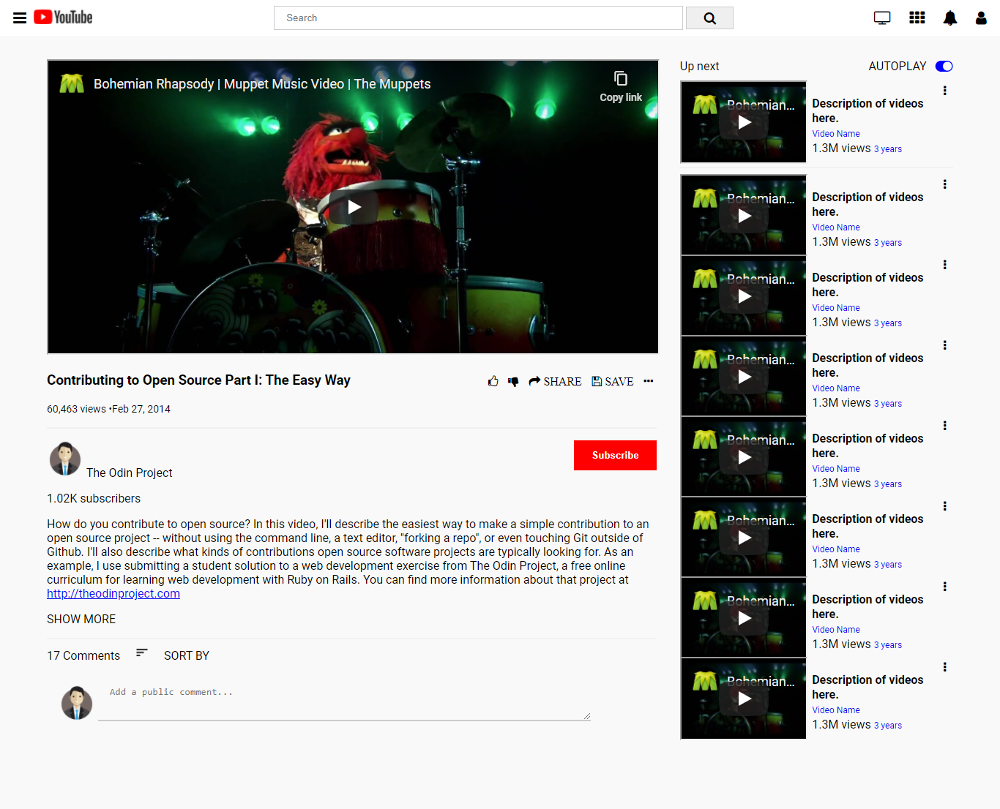

# YOUTUBE CLONE

This project is about cloning the Youtube video player page using HTML5 and CSS3 only.

## The following are some the features of this project:

1. Has a navigation search bar for searching any video
2. Has a video player section
3. Has aside section for recommended videos
4. Has a comment section for adding a comment
5. Has a description section for the description the playing video
5. Has some icons on the top right hand side for user profile, notifications, tv, and apps.
6. Has a profile image avatar for logged-in user
7. Has a subscribe button

## Built With

- HTML5
- CSS3

## Getting Started 

For one to get started, just clone the repository and open index.html file in your browser.

## Authors

 **Uchenna Martins Anya**

- Github: [uchennaanya](https://github.com/uchennaanya)
- Twitter:[@matinsanya19](https://twitter.com/martinsanya19)
- Linkedin: [Uchenna Martin Anya](https://www.linkedin.com/in/uchenna-anya/)

**Iris Enaelle Kineza** 

- Github: [KinezaEnaelle](https://github.com/KinezaEnaelle)
- Twitter: [@IKineza](https://twitter.com/ikineza)
- Linkedin: [Iris Enaelle Kineza](https://www.linkedin.com/in/iris-enaelle-kineza-25a676187/)

## Contributions

Faeture requests and issues are most welcome.

## Live Demo 

https://rawcdn.githack.com/uchennaanya/html-css/eb23efe944bcaefe8bd6ceda0e3f39842d8201d7/index.html

## Show your support

Give a ⭐️ if you like this project.

## Acknowledgments

- images have been used from [google](https://google.com/)
- icons used from [fontawesome](https://fontawesome.com/)

## License

This project is [GNU](https://github.com/uchennaanya/html-css/blob/add-license-1/LICENSE) licensed.
